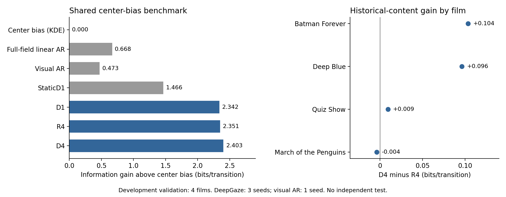

# DeepGaze video adaptation

Predict the next gaze landing in a video from the viewer's completed gaze events and the video frames available at saccade onset.

This research workspace adapts [DeepGaze3.5-VL](https://arxiv.org/abs/2607.02083) to the `fovlanding-v1` task. It compares current-frame, repeated-frame, and historical-frame inputs, plus spatial and autoregressive (AR) baselines. Every predictor is benchmarked against the same training-fitted center-bias distribution.

## Results

Information gain (IG) is the improvement in log likelihood over a training-only Gaussian KDE center bias, in bits per transition. Higher is better. All rows use the same 2,571 validation transitions, with equal weight for each of four source films.

| Model | Video input | IG above center bias |
|---|---|---:|
| Center bias (training KDE) | None | 0.000 |
| Persistence | None | 0.411 |
| Endpoint AR(4) | None | 0.612 |
| Full-field linear AR | None | 0.668 |
| Population visual AR | Four historical frames | 0.473 |
| StaticD1: released DeepGaze adapter | Current frame | 1.466 |
| D1: adapted DeepGaze | Current frame | 2.342 |
| R4: adapted DeepGaze | Current frame repeated four times | 2.351 |
| D4: adapted DeepGaze | Four historical frames | 2.403 |



DeepGaze D1/R4/D4 average three training seeds. Visual AR uses one seed and a different training budget. These are separate predictors, not a seed ensemble.

| Paired DeepGaze comparison | Mean gain, bits/transition |
|---|---:|
| D1 minus StaticD1: task adaptation | 0.8753 |
| D4 minus R4: historical image content | 0.0513 |
| D4 minus D1: four frames versus one | 0.0610 |

D4 beats R4 in all three seeds, but most of its selected-checkpoint gain comes from Batman Forever and Deep Blue. March of the Penguins has a small negative difference. At the common final update, D4 minus R4 is 0.0874 bits.

These are development results. The validation films also select checkpoints; no untouched final test is reported. Playback alignment and per-trial display geometry remain assumed. The AR comparison differs in pretraining, capacity, resolution, and optimization, so it does not isolate an architecture advantage.

See the [English manuscript](reports/DeepGaze35_Video_Manuscript.md) for methods and limitations. [Aggregate results](reports/results.json) include film and seed differences, descriptive intervals, and source hashes. The plot is regenerated by `scripts/plot_results.py`. Historical training logs use a histogram prior for their `ig_bits` field; the public results consistently subtract the KDE instead.

## Method

### Prediction task

- Merge adjacent valid fixation and pursuit events into foveations.
- Predict the grid cell containing the first raw gaze sample of the next foveation after a saccade.
- Use up to four completed foveations: start/end XY and relative start/end times.
- Require history gaze samples to precede the cutoff and video PTS to be at or before it.
- Break transitions at missing samples, invalid events, or unexplained gaps; do not skip invalid events or substitute a later target sample.
- Map valid coordinates into 100 x 100 half-open cells.

Event detection is offline. The models predict a landing at an observed event boundary; they do not predict saccade onset or generate complete eye-movement trajectories.

### DeepGaze

InternVL3.5-8B encodes images and passes their visual tokens, timestamps, and gaze-history text to a Qwen3 decoder. The vision encoder, projector, and base decoder are frozen. Training updates the existing rank-32 gaze LoRA, with 87,293,952 trainable parameters.

The decoder emits four coordinate digits. Renormalizing each digit position over 0-9 gives a normalized probability over all 10,000 cells. A teacher-forced forward pass evaluates the exact observed-cell likelihood.

D1 sees the current frame. D4 sees four causal frames at nominal offsets of -1, -2/3, -1/3, and 0 seconds. R4 keeps D4's timestamps and input length but repeats the current image. D4 minus R4 tests historical image content; it does not establish sensitivity to frame order.

Each condition trains for 1,000 updates with effective batch 16, AdamW learning rate 2e-5, and validation every 100 updates. Seeds 0, 1, and 2 share the same initialization and matched schedules within each seed.

### Autoregressive baselines and center bias

Visual AR uses frozen ImageNet ResNet18 features, 2 x 2 spatial pooling, a 32-unit GRU over gaze history, and five input-dependent diagonal Gaussians. Ordered frame features are compressed into a fixed context supplied to the GRU; the GRU does not recur over video frames. Gaussian cell integrals produce heatmaps and exact target likelihoods. The model has 77,689 trainable parameters and trains for 20 epochs.

Linear AR fits the next coordinate from previous endpoints or all six gaze-history fields. Ridge and scale choices use leave-one-training-film-out validation. The center-bias KDE uses only training landing positions, with Scott bandwidths. Its cell probabilities are held fixed for every model:

```text
IG(model) = mean_by_film(log2 p_model(target) - log2 p_center_bias(target))
```

## Code layout

```text
configs/       Target protocol and matched training settings
routeb/        Model loading, training, AR features, evaluation, checkpoints
scripts/       Data checks, comparisons, plotting, checkpoint deduplication
slurm/         LRZ batch entry point
tests/         Causality, probability, pairing, and checkpoint tests
reports/       Manuscript, aggregate results, and result plot
docs/          Running and publishing instructions
fovlanding.py  Event-to-target construction and prompt serialization
```

Root helper modules supply shared probability, model-input, and checkpoint functions. Datasets, model weights, environments, original trial provenance, and run directories stay outside the public repository.

## Running

The training workflow uses Slurm. On LRZ, submit installation, tests, hashing, decoding, plotting, and model computation through Slurm; login nodes are for editing and scheduler commands.

Set `ROUTEB_STORAGE` to your project data directory and `ROUTEB_INITIALIZATION` to the preserved official gaze-adapter directory. The latter must contain `initialization.json`, processor files, and `static/adapter_model.safetensors`. Exact experiment data and trained adapters are not bundled.

```bash
export ROUTEB_STORAGE=/path/to/project-storage
export ROUTEB_INITIALIZATION=/path/to/preserved-gaze-initialization
mkdir -p logs
sbatch slurm/fovlanding.sbatch setup
sbatch slurm/fovlanding.sbatch check
```

See [running instructions](docs/RUNNING.md) for input contracts, model preparation, training, comparisons, and LRZ resource requests. The fixed development cohort contains 7,144 training transitions from ten source films and 2,571 validation transitions from four other films.

To regenerate the plot on a local CPU environment:

```bash
python -m pip install matplotlib==3.10.7
python scripts/plot_results.py
```

On LRZ, run that plotting command inside a CPU allocation.

## Upstream resources and terms

- [DeepGaze3.5-VL paper](https://arxiv.org/abs/2607.02083) and [official code/adapter](https://github.com/Susmit-A/DeepGaze3.5-VL).
- [InternVL3.5-8B-HF](https://huggingface.co/OpenGVLab/InternVL3_5-8B-HF), pinned revision `741a7d03020411e666c6109218ab71e08151ef86`.
- [Hollywood eye-movement database](https://doi.org/10.1016/j.dib.2019.103991).

No license is supplied for this project's original code. The upstream DeepGaze evaluation code and gaze adapter are restricted to non-commercial research use. Base-model weights and datasets retain their own terms; this repository does not redistribute them.

For a first public release, use the [publishing instructions](docs/PUBLISHING.md) to export the reviewed source tree with a fresh Git history.
